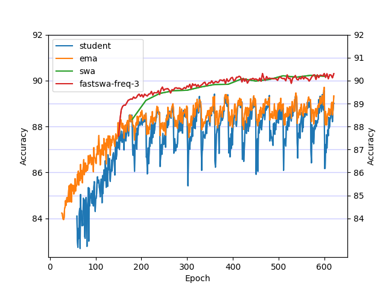
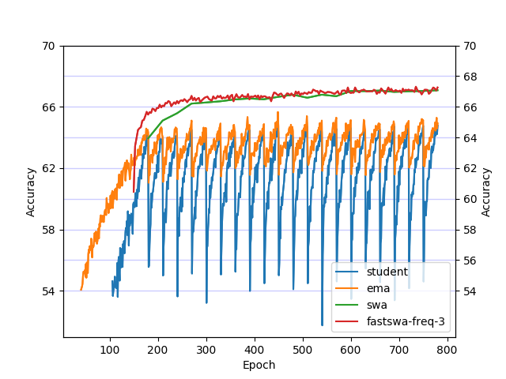

# There Are Many Consistent Explanations of Unlabeled Data: Why You Should Average

This repository contains the code for our paper [There Are Many Consistent Explanations of Unlabeled Data: Why You Should Average](https://openreview.net/pdf?id=rkgKBhA5Y7), which achieves the best known performance for semi-supervised learning on CIFAR-10 and CIFAR-100. By analyzing the geometry of training objectives involving consistency regularization, we can significantly improve the [Mean Teacher](https://arxiv.org/abs/1703.01780) model (Tarvainen and Valpola, NIPS 2017) and the [Pi](https://arxiv.org/abs/1610.02242) Model (Laine and Aila, ICLR 2017), using [stochastic weight averaging](https://arxiv.org/abs/1803.05407) (SWA) and our proposed variant **fast-SWA** which achieves faster reduction in prediction errors.


The BibTeX entry for the paper is:
```bibtex
@article{athiwaratkun2018improving,
  title={There Are Many Consistent Explanations of Unlabeled Data: Why You Should Average},
  author={Athiwaratkun, Ben and Finzi, Marc and Izmailov, Pavel and Wilson, Andrew Gordon},
  journal={ICLR},
  year={2019}
}
```

## Preparing Packages and Data

The code runs on Python 3 with Pytorch 0.3. The following packages are also required.
```
pip install scipy tqdm matplotlib pandas msgpack
```

Then prepare CIFAR-10 and CIFAR-100 with the following commands:

```
./data-local/bin/prepare_cifar10.sh
./data-local/bin/prepare_cifar100.sh
```

## Semi-Supervised Learning with fastSWA
We provide training scripts in folder *exps*. To replicate the results for CIFAR-10 using the Mean Teacher model on 4000 labels with a 13-layer CNN, run the following:

```
python experiments/cifar10_mt_cnn_short_n4k.py
```

Similarly, for CIFAR-100 with 10k labels:
```
python experiments/cifar100_mt_cnn_short_n10k.py
```

The results are saved to the directories **cifar10_mt_cnn_short_n4k** and **results/cifar100_mt_cnn_short_n10k**. The plot the accuracy versus epoch, run

```
python read_log.py --pattern results/cifar10_*n4k --cutoff 84 --interval 2 --upper 92
python read_log.py --pattern results/cifar100_*n10k --cutoff 54 --interval 4 --upper 70
```

<p align="center"> 


Figure 1. CIFAR-10 Test Accuracy of the Mean Teacher Model with SWA and fastSWA using a 13-layer CNN and 4000 labels.
</p>

<p align="center"> 


Figure 2. CIFAR-100 Test Accuracy of the Mean Teacher Model with SWA and fastSWA using a 13-layer CNN and 10000 labels.
</p>

We provide scripts for ResNet-26 with Shake-Shake regularization for CIFAR-10 and CIFAR-100, as well as other label settings in the directory **experiments**.

## fastSWA and SWA Implementation
fastSWA can be incorporated into training very conveniently with just a few lines of code. First, we initialize a replicate model (which can be set to require no gradients to save memory) and initialize the weight averaging optimization object.

```
fastswa_net = create_model(no_grad=True)
fastswa_net_optim = optim_weight_swa.WeightSWA(swa_model)
```

Then, the fastSWA model can be updated every *fastswa_freq* epochs. Note that after updating the weights, we need to update Batch Normalization running average variables by passing the training data through the fastSWA model. 
```
if epoch >= (args.epochs - args.cycle_interval) and (epoch - args.epochs - args.cycle_interval) % fastswa_freq == 0:
  fastswa_net_optim.update(fastswa_net)
  update_batchnorm(fastswa_net, train_loader, train_loader_len)
```
For more details, see **main.py**.

Note: the code is adapted from https://github.com/CuriousAI/mean-teacher/tree/master/pytorch
